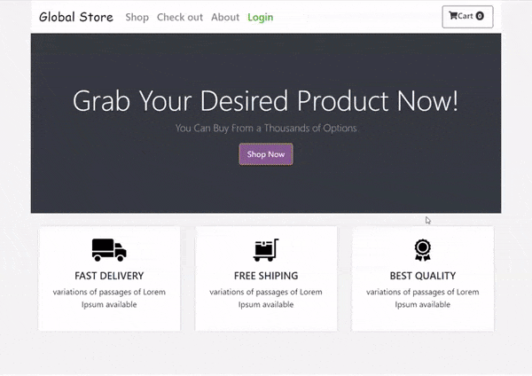
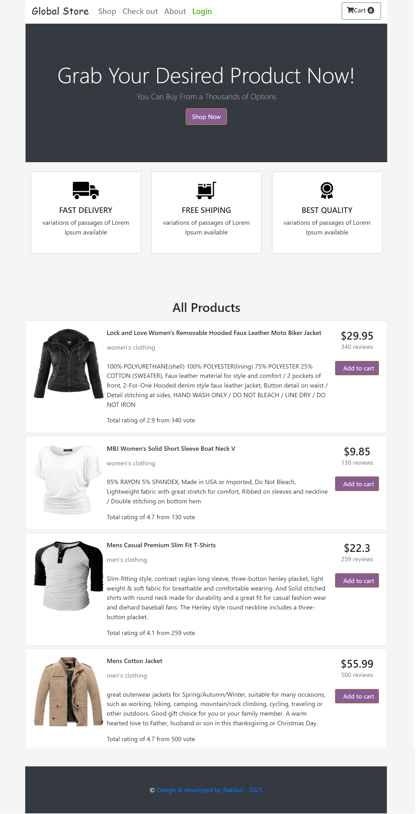
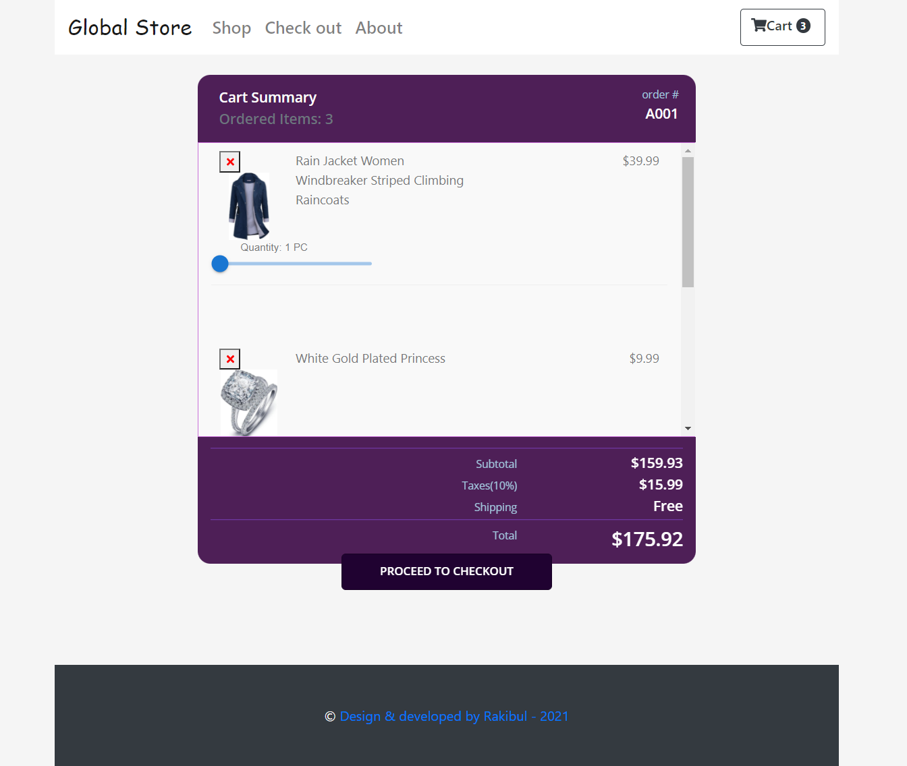

### This is an ecommerce app, build with **MERN Stack**
---

### Table of contents

  - [Overview](#overview)
  - [The key Features](#the-key-features)
  - [Technologies Used](#Technologies-used)
  - [Screenshot & Preview](#preview)
  - [Links](#links)
  - [What I learned](#what-i-learned)
  - [How To Run Locally](#how-to-run-locally)
  - [Useful resources](#useful-resources)
  - [Author](#author)

---

## Overview

Global Store is an E-commerce website that fulfill customer's daily needs. It allows the customer to select the item for their choice, add desire quantity and order it directly online via credit card payments. Furthermore the customer have to login to their personal account to place an order. The goal of this website is to give the site owner a simple and tempting approach to manage an ecommerce business and even become flexible to the global customer.

### The key Features
- **Responsive Design** across all device, including a hamburger menu button on smaller screens.
- Customer can add items to their shopping cart.
- A dynamic **shopping cart** is implemented.
- User can increase/decrease the quantity of any item while adding to the cart
- user also can delete items from cart.
- If a user wants to **checkout** they have to login first.
- **Private Route** was employed to protect some pages from unauthorized access and also used **Firebase authentication**.
- New user can register with entering email and password.
- They can also **login by google** account easily.
- After confirming the items in checkout page, customer can place order.
- **Stripe payment** method was implemented for payment purpose.
- This project was deployed using Git, GitHub, Heroku(for server side) & netlify(for client side).

<br>

### Technologies Used
- React 
- Context API
- Hooks
- React Bootstrap
- Material UI
- Firebase
- Font Awesome
- nodejs
- express
- mongodb
- Firebase Auth
- stripe payment gateway

<br>

### Preview



<br>

### Screenshots


<br>




### Links

- GitHub Link : [GitHub Link](https://github.com/Rakibul-Islam-GitHub/global-store-mern-project)
- Live Link : [Live Link](https://globalstore-mern-project.netlify.app/)


### What I learned
The main objective of this project was to gain experience working with `MERN STACK`. For client side implementation, `react` was used and `nodejs` & `expressjs` were used for building the backend. `REST api` method is used for passing data between client & server side. The project was running successfully and i lerned a lot building this project.


### How To Run Locally

#### 1. Clone repo

```
$ git clone git@github.com:Rakibul-Islam-GitHub/global-store-mern-project.git
$ cd global-store-mern-project
```

#### 2. Install MongoDB

Download it from here: https://docs.mongodb.com/manual/administration/install-community/

#### 3. Run Backend

```
$ npm install
$ npm start
```

#### 4. Run Frontend

```
# open new terminal
$ cd client
$ npm install
$ npm start
```


### Useful resources

[React - Doc](https://reactjs.org/) 
[React Router - Doc](https://reactrouter.com/web) 
[ExpressJs - Doc](https://expressjs.com/) 


---

## Author

- Linkedin - [Rakibul](https://linkedin.com/in/rakibul21)
